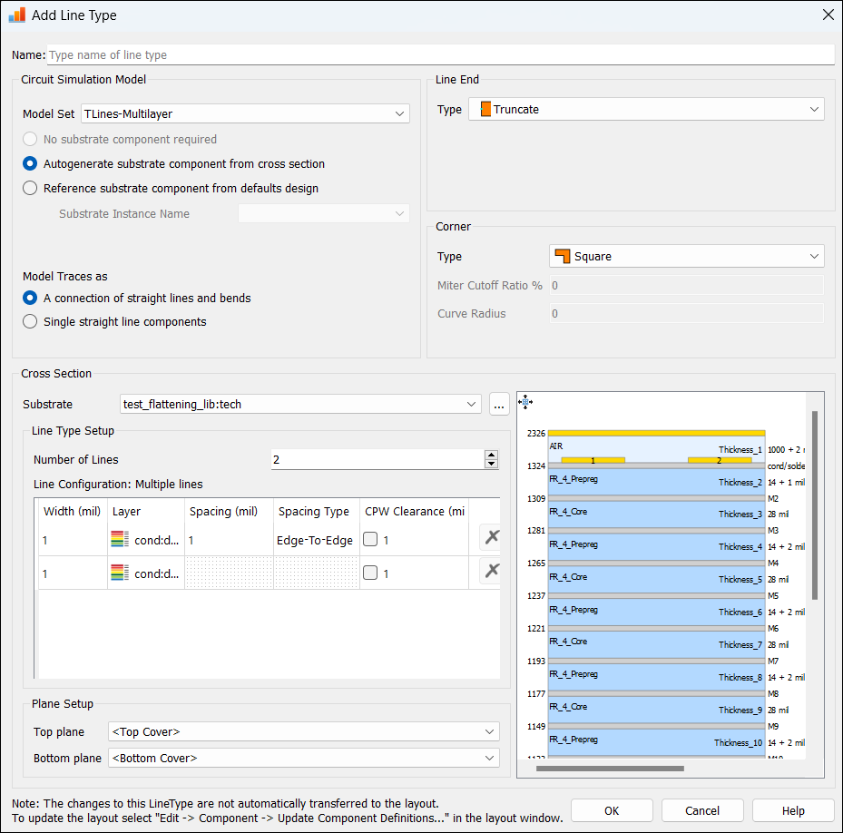

======================
Images and Hyperlinks
======================

Inserting an Image
==================

Here is an Image:

Inserting a Hyperlink
=====================

Custom Anchor
-------------

Here is an internal hyperlink:

.. _inserting-an-image:

Go to the :ref:`Inserting an Image <inserting-an-image>` for learning how to insert an image.

External Hyperlink
------------------

Here is an external hyperlink:

.. _Keysight-website: https://www.keysight.com

Go to the Keysight-website_ for more information.

Documentation Hyperlink
-----------------------

Here is a documentation hyperlink:

Click on :doc:`Learning with Python <new-file>` to learn more about Python.